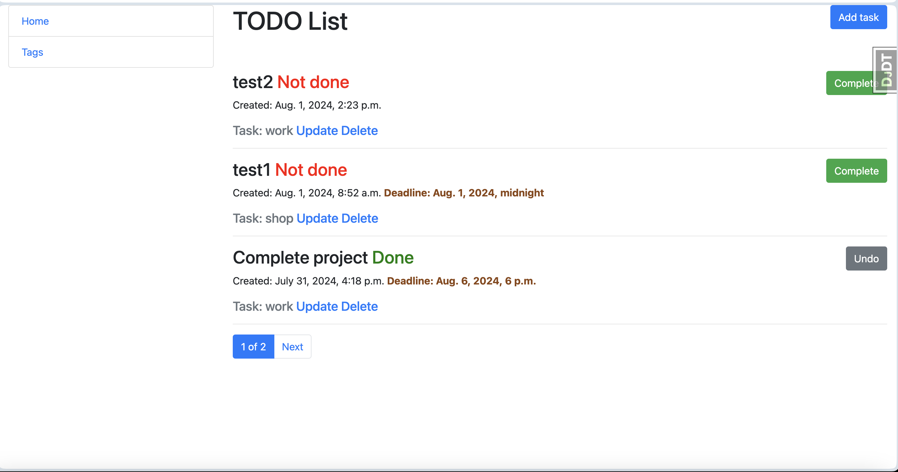
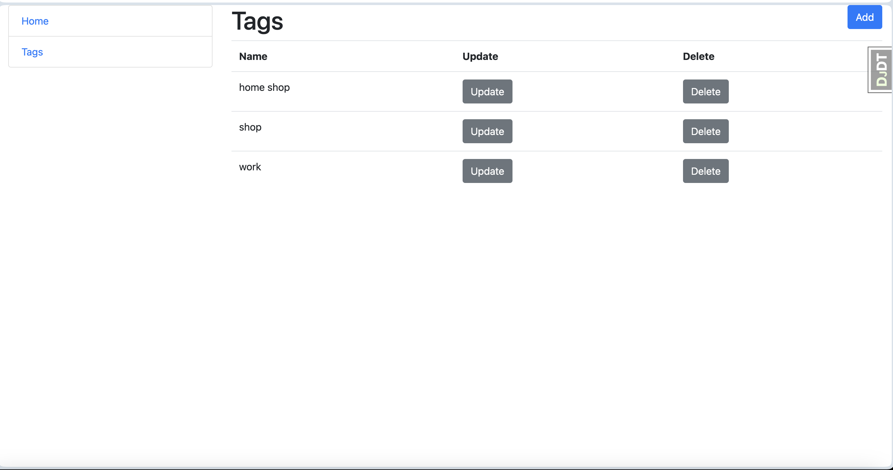

# Todo-List
Django test project for managing todo list site.

## Installation
Python3 must be already installed. 

```shell
git https://github.com/SerheiZhus/Todo-List
cd Todo-List
python3 -m venv venv
source venv/bin/activate
pip install -r requirements.txt
python manage.py, runserver
```
## Demo


